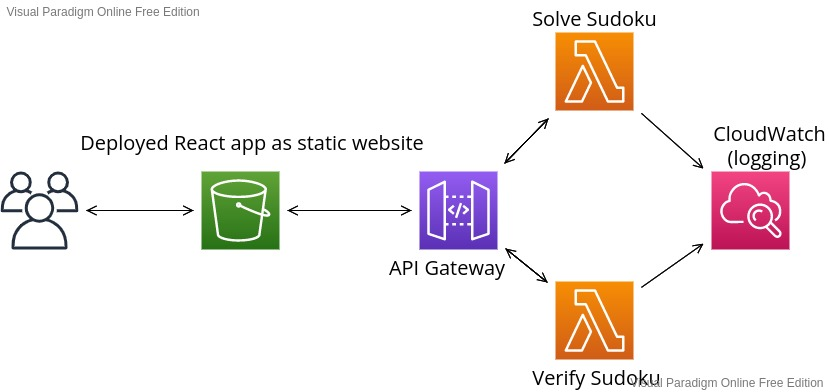
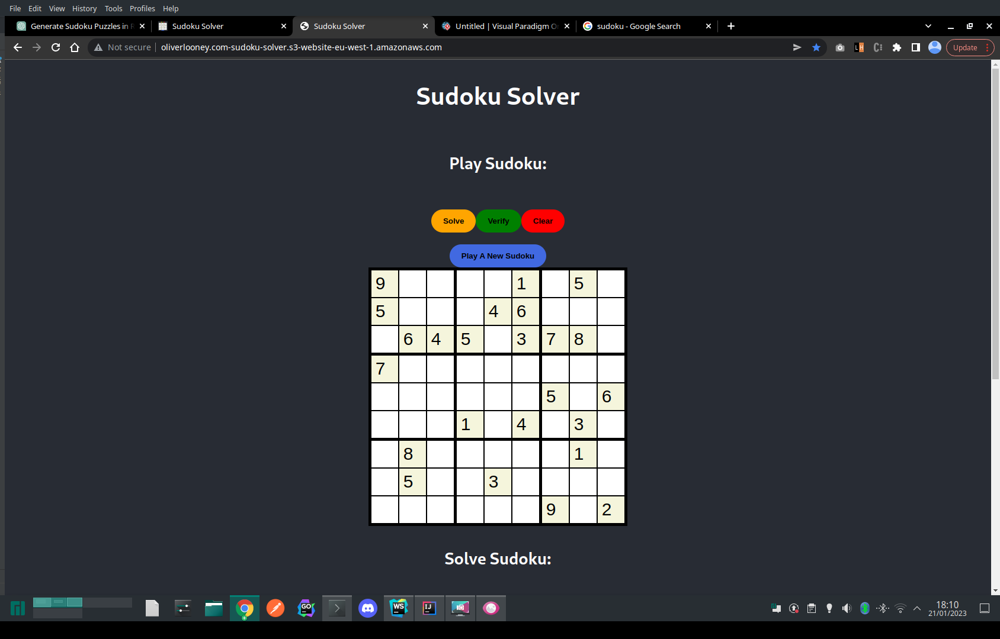
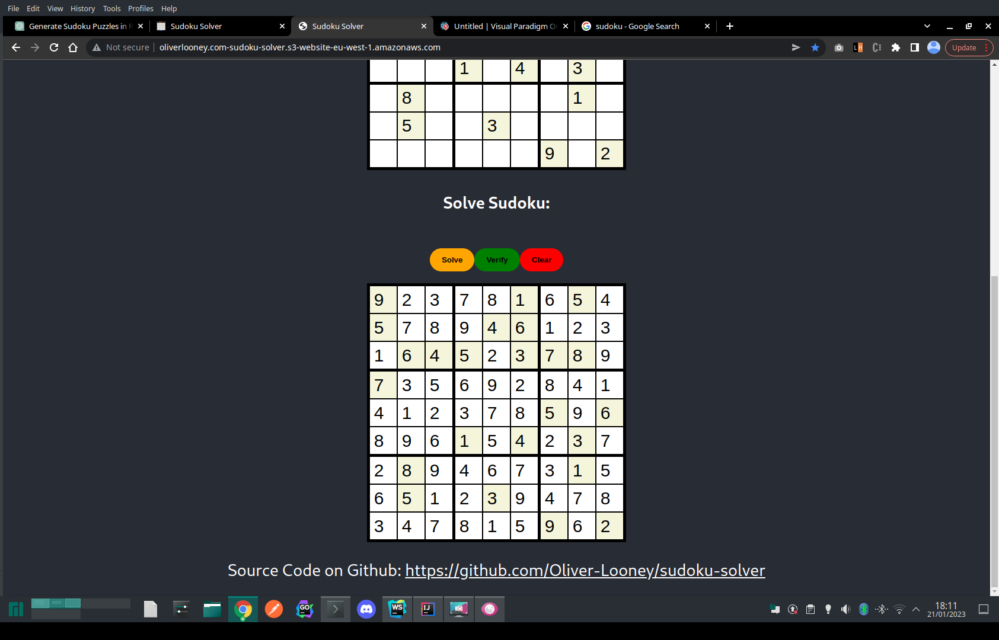

# Sudoku Solver
Web app that allows users to play a sudoku game or enter a puzzle to get the solution.
Built with React TypeScript for the front, hosted in a s3 bucket, and Lambdas built in GoLang.

Try it here:

http://oliverlooney.com-sudoku-solver.s3-website-eu-west-1.amazonaws.com/

Deployed on AWS:

## Screenshots

